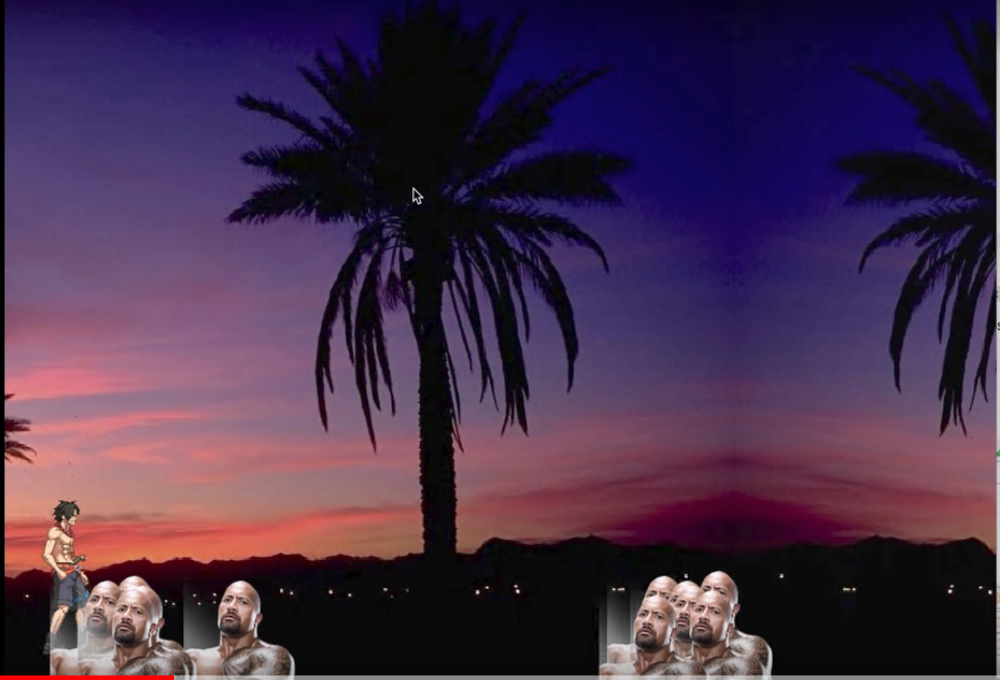

This was a very interesting attempt at creating a 2d platform game that went very wrong in some very weird ways. 

Project description availible [HERE](https://docs.google.com/document/d/1rg8TkZsJUn0Swfe3XWx2Ru2CkJWyKbPslaPlBqPdoHw/edit?usp=sharing)

Here you can see our [Example](https://www.youtube.com/watch?v=coXSSwqu-tQ)
 
Though I am planning to go back to this project and put in more work to make it more functional and acceptable as a project.

Source Code coming to a github near you.
