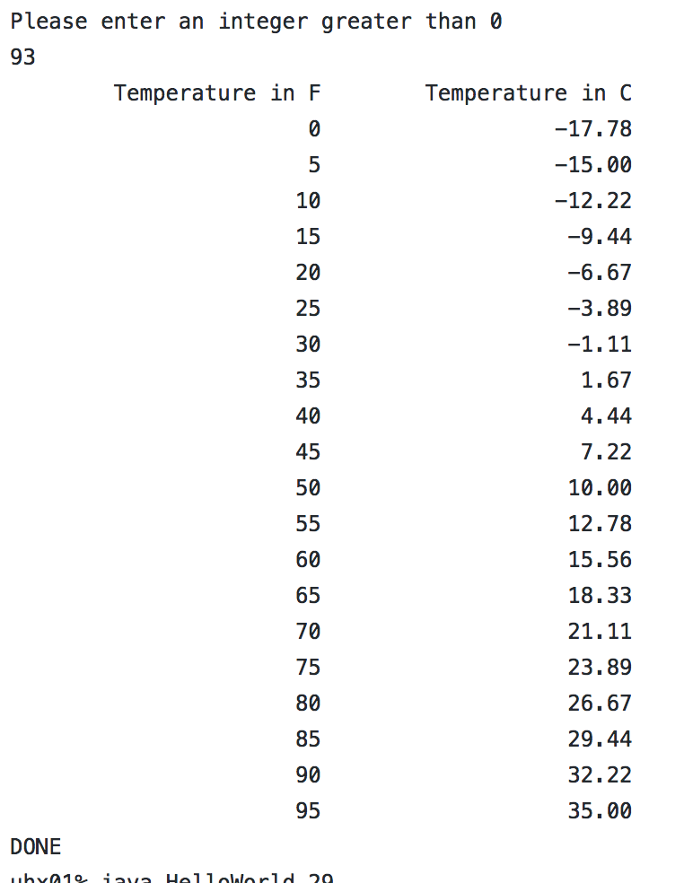

For this project that I did in my ICS 212 class, we had to create a function in c but call it in java using the JNI

C code availible [HERE](https://github.com/Liloa/jni_dabble/blob/master/HelloWorld.c)

Java code availible [HERE](https://github.com/Liloa/jni_dabble/blob/master/HelloWorld.c)
 

