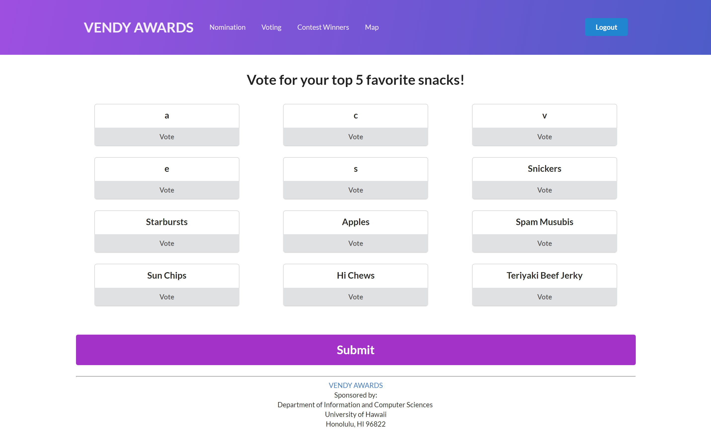
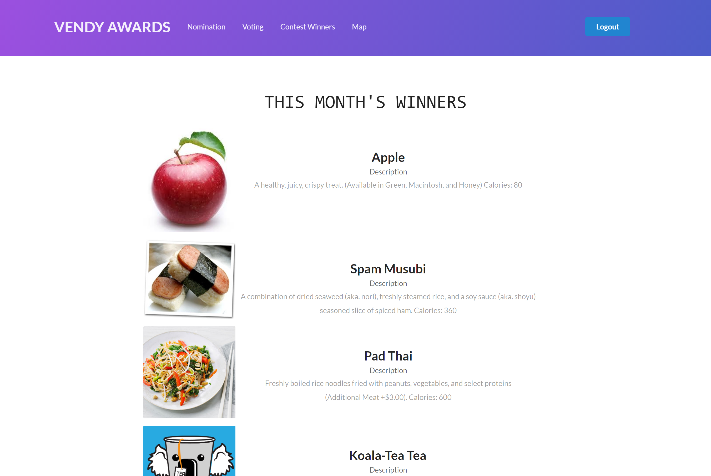

  <a href="https://vendyawards.meteorapp.com/">Vendy Awards</a> is a faux app that me and two peers created for our Software Engineering class. We used Meteor to deploy it onto Galaxy, making it accessible for anyone who has been previously authorized with a UH CAS login account to access and test out the features of our app. We used IntelliJ alongside Meteor to create each page of the app. Meteor also made it possible to run on mobile devices such as android.

<h1>About Vendy Awards</h1>

Vendy Awards is a Meteor application which provides the service of providing UH students with an opportunity to vote on which food items get placed in campus vending machines. It gives students a voice in their own community, so many things are run by executive people who could care less about what students want that may not be popularly known. This could lead to better sales of their vending machine items. Every month will consist of three stages and five pages total:

  <b>Landing Page:</b> Upon landing on the landing page, the user is presented with a short summary of each stage of the month along with a screenshot of what they page could look like at the time. They are then required to log in with their UH username and password, and then they will be redirected to the page designated for the stage of the month. 

<i> * In practice, the app would not have any menu bar and it would direct users to whichever stage of the month the process is in. Though to show users what it looks like at each stage we provided a menu bar which links users to each page. </i>

  <b>Nomination stage:</b> During thr nomination period, the work of each student is to enter their opinions for five different items to be placed in the pool for the next stage, the voting stage.

  <b>Voting stage:</b> During this stage there will be a pool of food items that students previously entered. There will be a limit of 5 items only and you can only vote for each item once. After they submit their votes they are redirected to the map page

  <b>Contest winners stage:</b> During this stage there is no work for anyone other than goignbyo it so they can see what's the next few things that are going to be in the vending machine near them.

  <b>Map Page:</b> A google map projection of all the vending machines on campus.

This project forced me and my team members to develop new skills and improve on some which we may have been somewhat familiar with. Group work made this project very interesting because we did not have similar schedules. This was overcome through sheer hard work and cooperation. We each have our own strengths and weaknesses and put each of our skills together to make eachother's weaknesses not as weak. This helped me learn to participate in group conversations, brain storming ideas to overcome challenges that pop up, also it helped me learn how to get a lot done with a group when the time really matters.

To learn more visit the following links for our organization's website and GitHub repository.

Source: 
  <a href="https://vendyawards.github.io"><i class="github alternate icon"></i>View Home Page</a>
  <a href="https://github.com/vendyawards/vendyawards"><i class="github square icon"></i>View Source Code</a>
