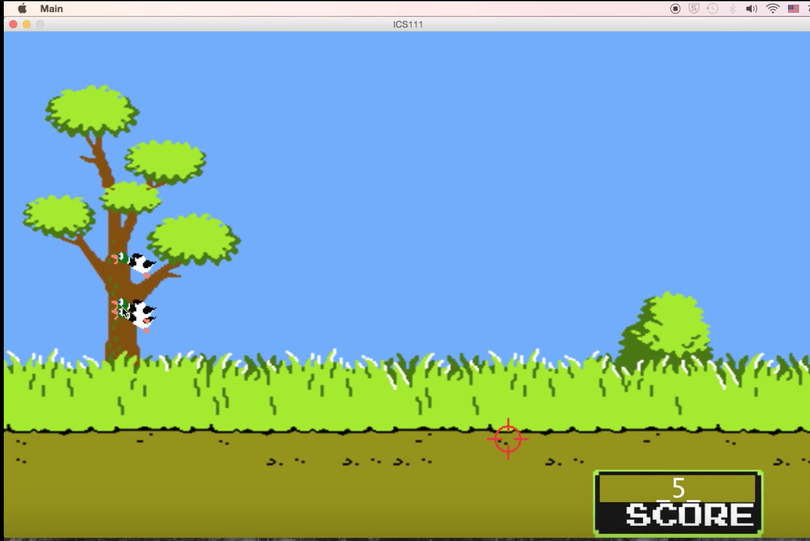

  
  

You can view a project description [Project](https://docs.google.com/document/d/1eEwh4Opjy3Znyaa7l_FlEpAkc-zOMjETIUnvu6G-C5I/edit?usp=sharing).

You can view an example at [Youtube](https://www.youtube.com/watch?v=5d9tguRUmH4).

Source Code will be availible soon on github.

